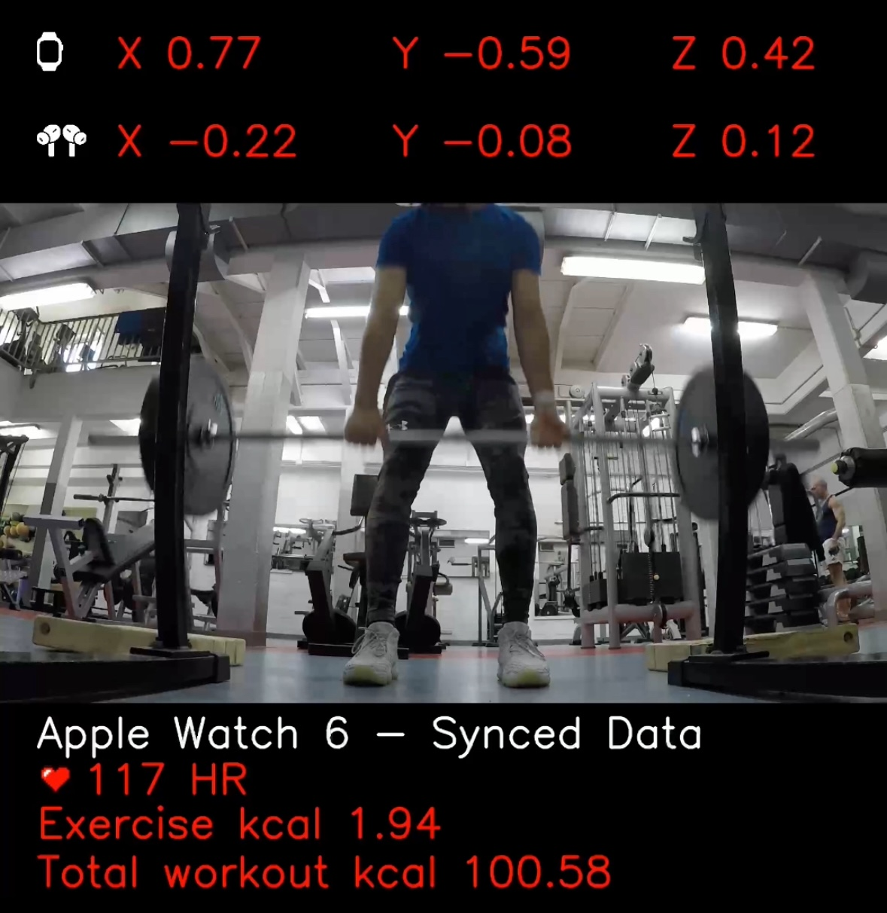

# Apple Health Video Overlay

## Requirements

This script relies on the [RunGap App](http://www.rungap.com) to export data from a specific workout in json format.

The script uses Python 3.12.2, all the packages used are automatically installed by running the [PipEnv](https://pipenv.pypa.io/en/latest/) environment.

## Instructions

1. Drop the exported json workout file from the RunGap app in the folder.
2. Import from your iPhone or GoPro the workout video you want to map your health data on.

    NOTE: It is essential for the video file to have the correct DateTime metadata, as that will be used to map the correct health data onto it.

3. Run the script.
4. Enjoy the video output.

